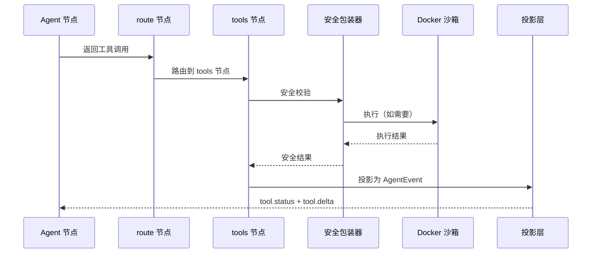

# 工具系统

SlotFlow 的工具系统负责工具的注册、发现、调度和安全执行。工具是 Agent 与外部世界交互的唯一途径，包括文件读写、Shell 命令、网络请求、Skills 调用和子代理委派。

## 架构分层

```
┌────────────────────────────────────────────┐
│              工具注册层                      │
│  harness/tools/registry.py                 │
│  ToolRegistry · 工具发现 · 绑定到 LLM       │
└──────────────────┬─────────────────────────┘
                   │
┌──────────────────┴─────────────────────────┐
│              工具执行层                      │
│  harness/graph.py (ToolNode)               │
│  SlotFlow 安全包装器                        │
└──────────────────┬─────────────────────────┘
                   │
┌──────────────────┴─────────────────────────┐
│              沙箱隔离层                      │
│  harness/sandbox/                          │
│  Docker 容器 · 线程目录隔离 · 产物发布       │
└────────────────────────────────────────────┘
```

## 工具注册

### ToolRegistry

`ToolRegistry` 是工具系统的中央注册表，位于 `harness/tools/registry.py`。它负责：

- **工具发现**：扫描 `harness/tools/` 目录，收集所有可用工具
- **工具分类**：按功能分组（文件、Shell、网络、Skills、子代理等）
- **绑定到模型**：将工具列表传递给 `model.bind_tools(tools)`

### 工具分类

| 类别 | 示例工具 | 说明 |
|------|----------|------|
| 文件操作 | `read_file`、`write_file`、`edit_file`、`glob`、`grep` | 工作区文件读写和搜索 |
| Shell 执行 | `sandbox_exec` | Docker 隔离的代码执行 |
| 产物管理 | `sandbox_artifact_copy` | 将 Docker 内生成的文件发布到 UI 产物区 |
| 网络工具 | HTTP 请求 | 通过 `httpx.Client` 发起的网络调用 |
| Skills 调用 | Skills 匹配和调用 | 调用已安装的 Skills |
| 子代理委派 | `task_tool` | 分层子代理委派 |

## 工具执行流程

一次工具调用的完整路径：

1. **模型请求工具** — Agent 节点中的 LLM 返回工具调用请求
2. **路由判断** — `route` 节点的 `tools_condition` 检测到工具调用，路由到 `tools` 节点
3. **安全包装** — SlotFlow 工具安全包装器校验权限和参数
4. **沙箱执行** — 对于 Shell/代码执行，进入 Docker 沙箱
5. **结果返回** — 工具执行结果以 `ToolMessage` 形式注入消息历史
6. **状态投影** — `projections.py` 将工具状态投影为 `tool.delta` 和 `tool.status` 事件



## Docker 沙箱

### 持久具名共享容器

沙箱使用**持久具名共享容器**模型：

- 空闲时仅停止不删除，保留容器状态
- 线程目录隔离：每个工具调用在独立的线程目录中执行
- 守护进程可自动拉起已停止的容器

### 关键工具

| 工具 | 功能 | 安全特性 |
|------|------|----------|
| `sandbox_exec` | 在 Docker 容器中执行任意代码 | 网络隔离、资源限制、超时控制 |
| `sandbox_artifact_copy` | 将 Docker 内文件发布到 UI 产物区 | 路径白名单、文件大小限制 |

### 沙箱配置

通过环境变量配置：

- `SLOTFLOW_DOCKER_SANDBOX_IMAGE`：沙箱使用的 Docker 镜像（默认 `python:3.12`）
- `SLOTFLOW_DOCKER_IMAGE`：bootstrap 阶段使用的别名

## 工具安全模型

### 同步与异步边界

工具提供双重接口以适应不同调用场景：

- **同步 `.invoke()`**：用于测试和脚本，直接调用
- **异步 `StructuredTool` 协程**：用于异步图运行，阻塞操作（文件解析、`httpx.Client`、Docker 子进程）通过 `asyncio.to_thread` 分发

### 安全包装器职责

- 参数校验：验证工具调用的参数合法性
- 权限检查：确认当前运行模式允许该工具执行
- 资源限制：超时控制、内存限制
- 错误处理：捕获工具执行异常，返回结构化错误

## 扩展指南

### 添加新工具

1. 在 `harness/tools/` 下创建工具实现文件
2. 实现同步 `.invoke()` 和异步 `StructuredTool` 协程
3. 在 `ToolRegistry` 中注册工具
4. 添加测试到 `backend/tests/`

详细步骤见 [扩展指南 - 添加工具](../development/extending.md#添加新工具)。

### 工具不变性条件

- **原子性**：每个工具调用是原子的，失败时回滚状态
- **隔离性**：沙箱工具调用之间互不影响，线程目录隔离
- **幂等性**：读工具（`read_file`、`glob`、`grep`）是幂等的；写工具（`write_file`、`edit_file`）不保证幂等

## 变更导航

| 变更意图 | 入口文件 | 关键符号 | 聚焦测试 |
|----------|----------|----------|----------|
| 添加新工具 | `backend/app/harness/tools/` | `ToolRegistry` | `backend/tests/` |
| 修改沙箱行为 | `backend/app/harness/sandbox/` | `sandbox_exec` | `backend/tests/` |
| 调整安全策略 | `backend/app/harness/graph.py` (ToolNode) | 安全包装器 | `backend/tests/` |

**最小验证命令：** `cd backend && uv run pytest -q`