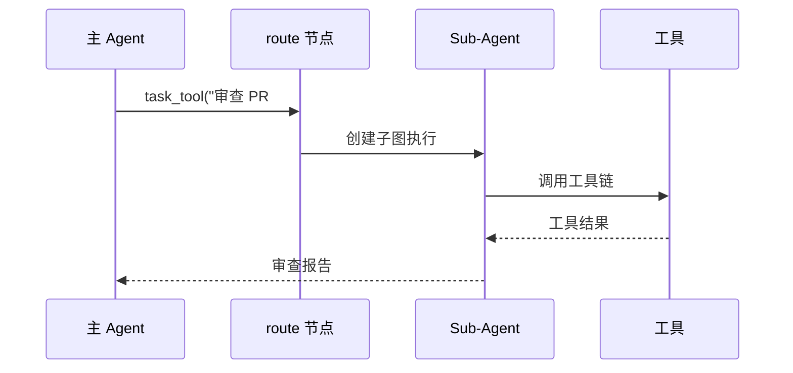

# SlotFlow 扩展指南

本文档提供 SlotFlow 各扩展点的开发指南，帮助开发者为 Agent 添加新能力。

## 目录

- [添加新工具](#添加新工具)
- [创建 Skills](#创建-skills)
- [配置 MCP 服务器](#配置-mcp-服务器)
- [扩展记忆后端](#扩展记忆后端)
- [Sub-Agent 委派](#sub-agent-委派)
- [扩展验证清单](#扩展验证清单)

---

## 添加新工具

工具是 Agent 与外部世界交互的基本单元。所有工具位于 `backend/app/harness/tools/`。

### 工具接口规范

每个工具必须提供双重接口：

```python
# 同步接口 — 用于测试和脚本
class MyTool(BaseTool):
    def invoke(self, **kwargs) -> ToolResult:
        ...

# 异步接口 — 用于图运行（阻塞操作通过 asyncio.to_thread 分发）
class MyTool(BaseTool):
    async def ainvoke(self, **kwargs) -> ToolResult:
        ...
```

### 实现步骤

**1. 创建工具文件**

在 `backend/app/harness/tools/` 下创建 `my_tool.py`：

```python
from langchain_core.tools import StructuredTool
from pydantic import BaseModel, Field

class MyToolInput(BaseModel):
    """工具参数模型"""
    query: str = Field(description="查询字符串")
    max_results: int = Field(default=10, description="最大结果数")

def my_tool_sync(query: str, max_results: int = 10) -> str:
    """同步实现"""
    # 实现工具逻辑
    return f"Results for: {query}"

async def my_tool_async(query: str, max_results: int = 10) -> str:
    """异步实现"""
    import asyncio
    # 阻塞操作通过 to_thread 分发
    result = await asyncio.to_thread(my_tool_sync, query, max_results)
    return result

def create_my_tool() -> StructuredTool:
    """创建工具实例"""
    return StructuredTool.from_function(
        name="my_tool",
        description="执行自定义查询操作",
        args_schema=MyToolInput,
        func=my_tool_sync,
        coroutine=my_tool_async,
    )
```

**2. 注册到 ToolRegistry**

在 `backend/app/harness/tools/registry.py` 中注册：

```python
from .my_tool import create_my_tool

class ToolRegistry:
    def _register_builtin_tools(self):
        # ... 现有工具 ...
        self.register(create_my_tool())
```

**3. 添加测试**

在 `backend/tests/` 下创建 `test_my_tool.py`：

```python
import pytest
from app.harness.tools.my_tool import my_tool_sync, my_tool_async

def test_my_tool_sync():
    result = my_tool_sync("test", max_results=5)
    assert "test" in result

@pytest.mark.asyncio
async def test_my_tool_async():
    result = await my_tool_async("test", max_results=5)
    assert "test" in result
```

### 工具安全注意事项

- **参数校验**：使用 Pydantic 模型定义参数，自动获得类型校验
- **超时控制**：长时间运行的工具需设置超时
- **错误处理**：捕获所有异常，返回结构化错误消息
- **沙箱隔离**：涉及代码执行的工具必须通过 Docker 沙箱

详见 [工具系统](../architecture/tool-system.md)。

---

## 创建 Skills

Skills 是预定义的工作流模板，Agent 可根据用户意图自动匹配和调用。

### Skill 结构

每个 Skill 是一个包含以下文件的目录：

```
skills/my-skill/
├── SKILL.md        # Skill 描述与触发条件（必需）
├── script.py       # Skill 实现脚本（可选）
└── config.yaml     # Skill 配置（可选）
```

### SKILL.md 格式

```markdown
# My Skill

简短描述 Skill 的功能。

## 触发条件

- 用户询问关于 X 的问题
- 用户需要执行 Y 操作

## 参数

| 参数 | 类型 | 说明 |
|------|------|------|
| `input` | string | 输入数据 |
| `format` | string | 输出格式 |

## 执行步骤

1. 解析用户输入
2. 执行核心逻辑
3. 返回格式化结果
```

### 注册 Skill

通过 API 或 CLI 安装：

```bash
# 通过 API（前端 UI 管理）
curl -X POST http://localhost:8000/skills/install \
  -F "skill=@skills/my-skill.zip"

# 或手动放置到 skills 目录
cp -r my-skill /path/to/slotflow/skills/
```

### Skill 生命周期

1. **发现** — Agent 启动时扫描 skills 目录
2. **匹配** — `harness/skills/` 中的匹配逻辑根据用户查询触发相关 Skill
3. **调用** — Skill 作为工具暴露给 LLM
4. **执行** — Skill 脚本在 Docker 沙箱中运行

---

## 配置 MCP 服务器

MCP (Model Context Protocol) 允许 SlotFlow 连接外部工具服务器。

### 添加 MCP 服务器

在 `backend/.env` 中配置：

```bash
# MCP 服务器配置
MCP_SERVERS='[
  {
    "name": "my-mcp-server",
    "command": "python",
    "args": ["-m", "my_mcp_server"],
    "env": {"API_KEY": "${MY_API_KEY}"}
  }
]'
```

### MCP 工具发现

配置后，MCP 服务器的工具自动注册到 ToolRegistry：

1. SlotFlow 启动 MCP 服务器进程
2. 通过 MCP 协议查询可用工具列表
3. 工具自动绑定到 Agent 的 LLM 调用

详见 `backend/app/mcp/routes.py`。

---

## 扩展记忆后端

SlotFlow 默认使用 SQLite 存储长期记忆，可通过实现 `MemoryStore` 接口扩展。

### 记忆存储接口

```python
class MemoryStore(ABC):
    @abstractmethod
    async def save(self, session_id: str, entry: MemoryEntry) -> None:
        """保存记忆条目"""
        ...

    @abstractmethod
    async def search(self, session_id: str, query: str, top_k: int = 5) -> list[MemoryEntry]:
        """搜索相关记忆"""
        ...

    @abstractmethod
    async def delete(self, session_id: str, entry_id: str) -> None:
        """删除记忆条目"""
        ...
```

### 实现自定义后端

```python
# backend/app/harness/memory/vector_store.py
class VectorMemoryStore(MemoryStore):
    def __init__(self, embedding_model: str = "text-embedding-3-small"):
        self.embeddings = OpenAIEmbeddings(model=embedding_model)
        self.vectorstore = Chroma(embedding_function=self.embeddings)

    async def save(self, session_id: str, entry: MemoryEntry) -> None:
        embedding = await self.embeddings.aembed_query(entry.content)
        self.vectorstore.add_texts(
            texts=[entry.content],
            metadatas=[{"session_id": session_id, "entry_id": entry.id}]
        )

    async def search(self, session_id: str, query: str, top_k: int = 5) -> list[MemoryEntry]:
        results = self.vectorstore.similarity_search(query, k=top_k)
        return [MemoryEntry.from_metadata(r.metadata, r.page_content) for r in results]
```

### 注册自定义后端

在 `backend/app/harness/builder.py` 中配置：

```python
from .memory.vector_store import VectorMemoryStore

def build_slotflow_harness_graph(config: dict):
    memory_store = VectorMemoryStore()
    # ... 传递到图节点 ...
```

---

## Sub-Agent 委派

Sub-Agent 机制允许主 Agent 将复杂子任务委派给独立的 Agent 实例。

### 创建 Sub-Agent

```python
# backend/app/harness/subagents/code_reviewer.py
from ..tools.registry import ToolRegistry
from ..builder import build_subagent_graph

class CodeReviewerConfig:
    name = "code_reviewer"
    description = "审查代码变更，检查代码质量、安全漏洞和最佳实践"
    tools = ["read_file", "glob", "grep"]
    model = "claude-3-5-sonnet-20240620"
    max_iterations = 10

def create_code_reviewer() -> SubAgentConfig:
    return SubAgentConfig(
        name=CodeReviewerConfig.name,
        description=CodeReviewerConfig.description,
        tools=ToolRegistry.get_tools(CodeReviewerConfig.tools),
        model=CodeReviewerConfig.model,
        max_iterations=CodeReviewerConfig.max_iterations,
        graph=build_subagent_graph(CodeReviewerConfig),
    )
```

### 注册 Sub-Agent

在 `ToolRegistry` 中注册为 `task_tool`：

```python
from .subagents.code_reviewer import create_code_reviewer

class ToolRegistry:
    def _register_subagents(self):
        self.register_subagent(create_code_reviewer())
```

### Sub-Agent 执行模型



### 并发控制

`post_model` 节点对 `task_tool` 实施并发上限控制，防止过多子代理同时运行消耗资源。默认并发上限可在配置中调整。

---

## 扩展验证清单

完成扩展开发后，按以下清单验证：

### 代码质量

```bash
cd backend && uv run pytest -q          # 后端测试
cd frontend && pnpm test                 # 前端测试
cd frontend && pnpm typecheck            # TypeScript 类型检查
```

### 集成验证

```bash
make verify                              # 完整验证
```

### 功能验证

- [ ] 新工具在模型工具列表中可见
- [ ] 工具调用返回正确结果
- [ ] 错误情况正确处理
- [ ] 异步和同步接口均通过测试
- [ ] Skills 可被 Agent 自动匹配和调用
- [ ] Sub-Agent 委派正确执行并返回结果
- [ ] 记忆保存和检索正常工作

### 安全检查

- [ ] 工具参数经过 Pydantic 校验
- [ ] 代码执行通过 Docker 沙箱隔离
- [ ] 文件访问限制在工作区范围内
- [ ] 敏感信息不记录到日志

### 文档更新

- [ ] 更新 `AGENTS.md` 反映行为变更
- [ ] 更新 `HARNESS_NOTES.md` 记录 Harness 变更
- [ ] 更新相关架构文档