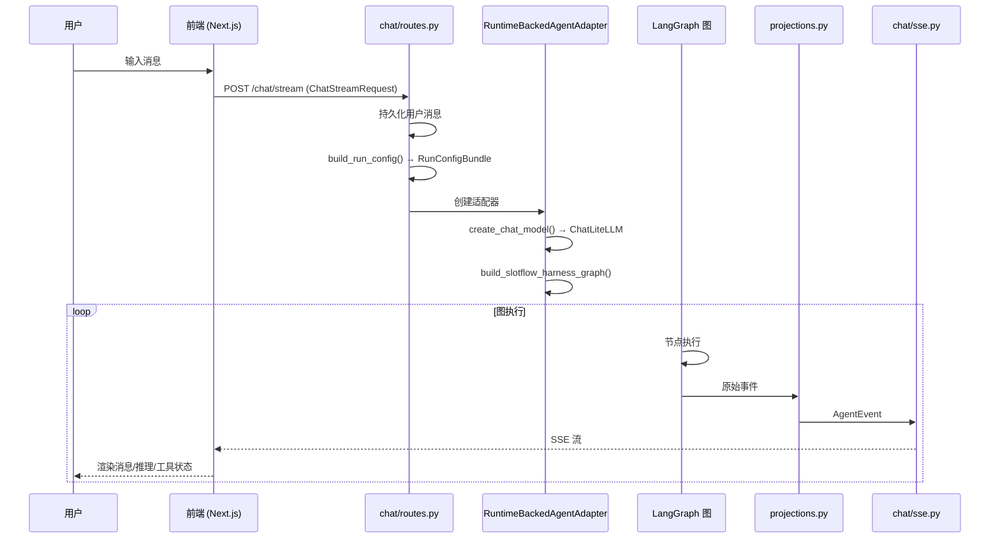

# 聊天请求端到端流程

本文档描述 SlotFlow 中一次聊天请求从用户输入到流式响应的完整生命周期。

## 流程概览



## 阶段一：前端发起请求

### 入口组件

用户通过 `components/chat/chat-app.tsx` 聊天界面输入消息。前端通过 `hooks/use-chat-stream.ts` 管理聊天流状态。

### 请求体构建

前端构建 `ChatStreamRequest` 并 POST 到聊天流端点：

```typescript
// ChatStreamRequest 结构
{
  message: string,           // 用户消息文本
  model_name: string,        // 选择的模型名称，如 "deepseek/deepseek-chat"
  provider: string,          // 模型供应商
  mode: string,              // 运行模式
  thinking_enabled: boolean, // 是否启用推理流
  files: File[]              // 上传的文件列表
}
```

## 阶段二：路由层处理

### 消息持久化

`chat/routes.py` 首先持久化用户消息到 SQLite（通过 `chat/repository.py`），确保消息不丢失。

### 构建运行配置

`chat/run_config.build_run_config` 将请求转换为 `RunConfigBundle`：

```
RunConfigBundle = {
    config: {
        "configurable": {
            "thread_id": "session-xxx"  // LangGraph 多轮对话检查点键
        }
    },
    context: RunContext {
        model_name: "deepseek/deepseek-chat",
        model_provider: "deepseek",
        mode: "default",
        thinking_enabled: true,
        plan_enabled: false,
        subagent_enabled: true,
        files: [...]
    }
}
```

**关键边界**：
- `config.configurable.thread_id` 是 LangGraph 运行时键，用于多轮对话状态恢复
- `RunContext` 是 SlotFlow 业务开关，控制 Agent 行为

## 阶段三：运行时适配

### 模型创建

`chat/runtime/adapter.py (RuntimeBackedAgentAdapter)` 创建 `ChatLiteLLM` 模型实例：

1. 读取 `RunContext.model_provider`（如 `"deepseek"`）
2. 调用 `runtime/models.create_chat_model` → 路由到对应供应商
3. 从环境变量获取 API Key 和 Base URL
4. 配置模型参数（temperature、max_tokens 等）
5. 返回可绑定工具的模型实例

### 图组装

调用 `harness/builder.build_slotflow_harness_graph` → `harness/graph.build_slotflow_graph`：

1. 组装工具注册表（`ToolRegistry`）
2. 配置 Skills 预检和记忆系统
3. 构建 LangGraph `StateGraph`（显式节点 + 边）
4. 编译为可执行的图

## 阶段四：图执行

### 节点序列

图按以下拓扑执行（详见 [Harness 引擎](../architecture/harness.md)）：

```
prepare → triage_gate → pre_model → SlotFlowSummarizationMiddleware
→ agent → post_model → route
    ├─ tools → pre_model   (ReAct 循环)
    ├─ pre_model           (todo 强制执行重试)
    └─ finalize → END
```

### 事件流

图执行过程中，每个节点产生原始 LangGraph 事件。这些事件通过 **LangGraph v3 投影协议** 流式输出。

## 阶段五：事件投影

### projections.py

`chat/agent_adapter/projections.py` 将原始 LangGraph 事件映射为 SlotFlow `AgentEvent`：

| 原始事件 | AgentEvent | 说明 |
|----------|-----------|------|
| LLM reasoning tokens | `message.delta` (channel=`reasoning`) | 模型推理过程 |
| LLM text output | `message.delta` (channel=`content`) | 模型文本回答 |
| Graph state checkpoint | `state.snapshot` | 状态快照 |
| Tool call start/progress | `tool.delta` | 工具调用增量 |
| Tool execution result | `tool.status` | 工具执行状态 |
| Clarification interrupt | `clarification.requested` | 需要用户澄清 |
| Todo list update | `todo.updated` | 待办事项更新 |
| Run lifecycle | `run.started` / `run.complete` / `run.error` | 运行生命周期 |

### 供应商差异归一化

不同模型供应商的流式输出格式不同。投影层在映射前归一化这些差异，确保前端收到统一的事件格式。

## 阶段六：SSE 编码

### chat/sse.py

`chat/sse.py` 将 `AgentEvent` 编码为 SSE 格式：

```
event: message.delta
data: {"channel": "content", "delta": "根据您的要求"}

event: message.delta
data: {"channel": "content", "delta": "，我来分析"}

event: tool.status
data: {"tool_name": "read_file", "status": "running"}

event: tool.status
data: {"tool_name": "read_file", "status": "complete", "result": "..."}

event: run.complete
data: {}
```

## 阶段七：前端消费

### SSE 解析

`frontend/src/lib/chat-stream.ts` 解析 SSE 事件流：

1. 建立 SSE 连接
2. 解析 `event` 和 `data` 字段
3. 转换为 TypeScript 类型

### UI 渲染

`frontend/src/hooks/use-chat-stream.ts` 管理渲染状态：

| AgentEvent | UI 渲染 |
|-----------|---------|
| `message.delta` (reasoning) | 可折叠的推理面板 |
| `message.delta` (content) | 消息气泡（流式打字效果） |
| `tool.status` | 工具调用状态指示器 |
| `clarification.requested` | 澄清选择器弹窗 |
| `todo.updated` | 待办事项列表 |
| `state.snapshot` | 工作区文件面板 |

## 关键不变性条件

1. **消息持久化优先**：用户消息在请求处理开始前已持久化，即使后续出错也不会丢失
2. **事件顺序保证**：SSE 事件顺序与图执行顺序严格一致
3. **通道隔离**：`reasoning` 和 `content` 通道独立累积和渲染
4. **断点续传**：每步执行后自动保存 LangGraph 检查点，支持中断后恢复
5. **连接断开处理**：SSE 断开时前端保留已接收的消息状态

## 变更导航

| 变更意图 | 入口文件 | 关键符号 | 聚焦测试 |
|----------|----------|----------|----------|
| 修改请求格式 | `frontend/src/hooks/use-chat-stream.ts` | `ChatStreamRequest` | `frontend/src/` |
| 调整路由逻辑 | `backend/app/chat/routes.py` | `build_run_config` | `backend/tests/` |
| 修改事件映射 | `backend/app/chat/agent_adapter/projections.py` | `AgentEvent` | `backend/tests/` |
| 调整 SSE 格式 | `backend/app/chat/sse.py` | SSE 编码函数 | `backend/tests/` |
| 修改 UI 渲染 | `frontend/src/components/chat/` | React 组件 | `frontend/src/` |

**最小验证命令**：
- 后端：`cd backend && uv run pytest -q`
- 前端：`cd frontend && pnpm test`
- 端到端：`make dev`，在浏览器中测试聊天功能