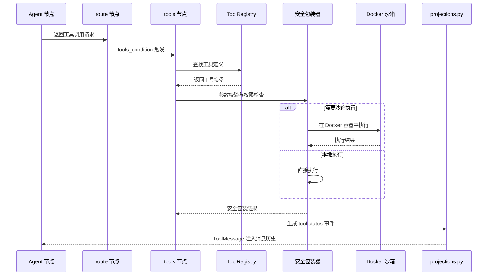
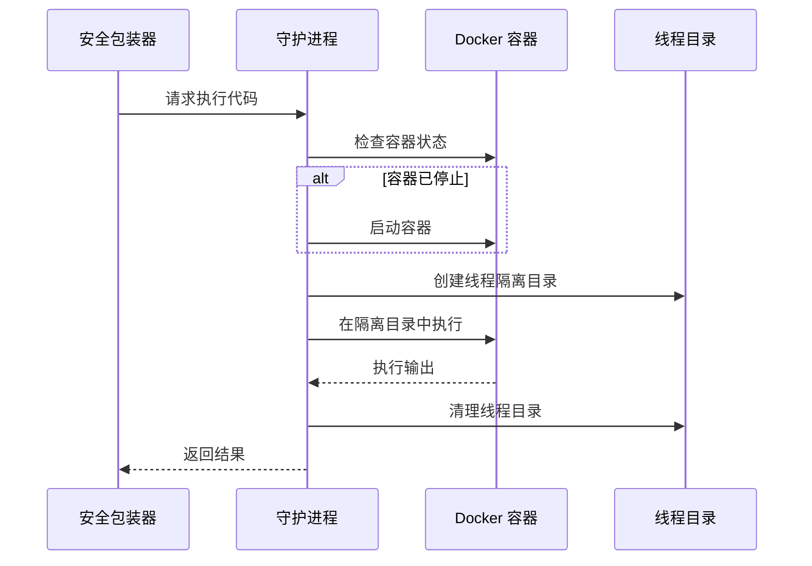

# 工具执行与沙箱隔离流程

本文档描述 SlotFlow 中一次工具调用从模型决策到结果返回的完整生命周期，重点说明 Docker 沙箱隔离机制。

## 流程概览



## 阶段一：工具请求触发

### 模型决策

在 [Harness 引擎](../architecture/harness.md) 的 `agent` 节点中，LLM 通过 `model.bind_tools(tools)` 绑定了所有可用工具。当模型判断需要调用工具时，返回工具调用请求。

### 路由判断

`route` 节点通过 `tools_condition` 检测到工具调用请求后，将执行流路由到 `tools` 节点。`tools` 节点是 LangGraph 的 `ToolNode` 加上 SlotFlow 自定义的安全包装器。

## 阶段二：工具查找与校验

### 工具注册表查找

`ToolNode` 首先从 [工具系统](../architecture/tool-system.md) 的 `ToolRegistry` 中查找模型请求的工具定义：

```python
# 伪代码示意
tool = ToolRegistry.get_tool(tool_name)
if not tool:
    return ToolMessage(content=f"工具 {tool_name} 未注册", status="error")
```

### 参数校验

工具实例包含 Pydantic 参数模型，自动进行类型校验：

```python
# 工具参数由 Pydantic 模型定义
class ReadFileInput(BaseModel):
    path: str = Field(description="文件路径")
    max_bytes: int = Field(default=50000, description="最大读取字节数")

# 校验失败时返回结构化错误
try:
    args = ReadFileInput(**tool_call_args)
except ValidationError as e:
    return ToolMessage(content=f"参数错误: {e}", status="error")
```

## 阶段三：安全包装器

SlotFlow 工具安全包装器对每个工具调用施加多层保护。

### 权限检查

包装器根据运行模式决定工具是否允许执行：

| 运行模式 | 文件读取 | 文件写入 | Shell 执行 | 网络请求 |
|----------|----------|----------|------------|----------|
| `default` | ✅ | ✅ | ❌ | ❌ |
| `coding` | ✅ | ✅ | ✅ (沙箱) | ❌ |
| `research` | ✅ | ❌ | ❌ | ✅ |
| `untrusted` | ✅ | ❌ | ✅ (严格沙箱) | ❌ |

### 资源限制

- **超时控制**：每个工具调用有默认超时（通常 30 秒）
- **输出大小限制**：工具输出过大时截断并标记
- **并发限制**：`post_model` 节点限制并发子代理数量

## 阶段四：执行分发

工具执行根据类型分为两条路径：

### 本地执行路径

文件操作、工作区工具等直接在工作区目录执行：

```
ToolNode → 安全包装器 → 本地文件系统操作
```

- `read_file`：直接读取工作区文件
- `write_file` / `edit_file`：在工作区范围内写入
- `glob` / `grep`：在工作区内搜索

### Docker 沙箱执行路径

涉及代码执行或不可信操作的工具进入 Docker 沙箱：

```
ToolNode → 安全包装器 → Docker 沙箱容器
```

#### 持久具名共享容器

沙箱采用持久具名共享容器模型，详见 [工具系统 - Docker 沙箱](../architecture/tool-system.md#docker-沙箱)：

- **空闲只停不删**：容器停止后保留状态，下次执行时复用
- **线程目录隔离**：每次调用在独立线程目录中执行
- **守护进程自动拉起**：如果容器未运行，守护进程自动启动

#### sandbox_exec 执行流程



#### sandbox_artifact_copy 流程

`sandbox_artifact_copy` 将 Docker 容器内生成的文件发布到 UI 产物区：

1. 安全包装器校验源路径在允许的目录中
2. 从 Docker 容器复制文件到工作区产物目录
3. 前端工作区面板自动展示新产物

## 阶段五：结果处理

### 结果包装

工具执行结果统一包装为 `ToolMessage`：

```python
ToolMessage(
    content="执行结果文本",
    tool_call_id="call_xxx",
    name="tool_name",
    status="complete"  # or "error"
)
```

### 状态投影

[聊天 API](../architecture/chat-api.md) 的投影层将工具执行状态映射为 `AgentEvent`：

| 工具状态 | AgentEvent | 前端渲染 |
|----------|-----------|----------|
| `running` | `tool.status` (status=`running`) | 工具调用指示器（旋转图标） |
| `complete` | `tool.status` (status=`complete`) | 工具调用完成（绿色勾） |
| `error` | `tool.status` (status=`error`) | 工具调用失败（红色叉） |

所有工具执行状态通过 `tool.status` 事件挂载在消息子流 `tool_calls` 投影上，前端可实时查看每个工具的执行进度。

## 阶段六：状态恢复

### 工具结果注入

工具执行结果以 `ToolMessage` 形式注入消息历史：

```
Messages: [HumanMessage, AIMessage(tool_calls=[...]), ToolMessage(result), ...]
```

### 图循环继续

`tools` 节点完成后，执行流回到 `pre_model` 节点：

```
tools → pre_model → agent → ... (ReAct 循环)
```

## 关键不变性条件

1. **原子性**：每个工具调用是原子的——要么完全执行，要么回滚
2. **隔离性**：沙箱工具调用线程目录隔离，互不影响
3. **幂等性**：读工具（`read_file`、`glob`、`grep`）是幂等的；写工具不保证幂等
4. **超时保护**：长时间运行的工具会被强制终止
5. **输出限制**：超大输出被截断以防止上下文溢出

## 调试与测试

### 工具执行日志

工具执行日志记录在以下位置：
- 工具调用参数和结果：图执行日志
- Docker 沙箱输出：守护进程日志
- 错误堆栈：`tool.status` 事件中包含的错误信息

### 测试工具

```bash
# 运行工具相关测试
cd backend && uv run pytest -q -k "tool"

# 运行沙箱相关测试
cd backend && uv run pytest -q -k "sandbox"
```

### 手动验证

```bash
# 启动开发服务器
make dev

# 在聊天界面测试工具调用：
# "读取 README.md 文件"
# "列出 /backend/app 目录"
# "运行 Python 代码：print('hello')"
```

## 变更导航

| 变更意图 | 入口文件 | 关键符号 | 聚焦测试 |
|----------|----------|----------|----------|
| 添加新工具 | `backend/app/harness/tools/` | `ToolRegistry.register` | `backend/tests/` |
| 修改安全策略 | `backend/app/harness/graph.py` | ToolNode 安全包装器 | `backend/tests/` |
| 调整沙箱行为 | `backend/app/harness/sandbox/` | `sandbox_exec` 相关函数 | `backend/tests/` |
| 修改并发限制 | `backend/app/harness/graph.py` | `post_model` 节点 | `backend/tests/` |

**最小验证命令**：`cd backend && uv run pytest -q`